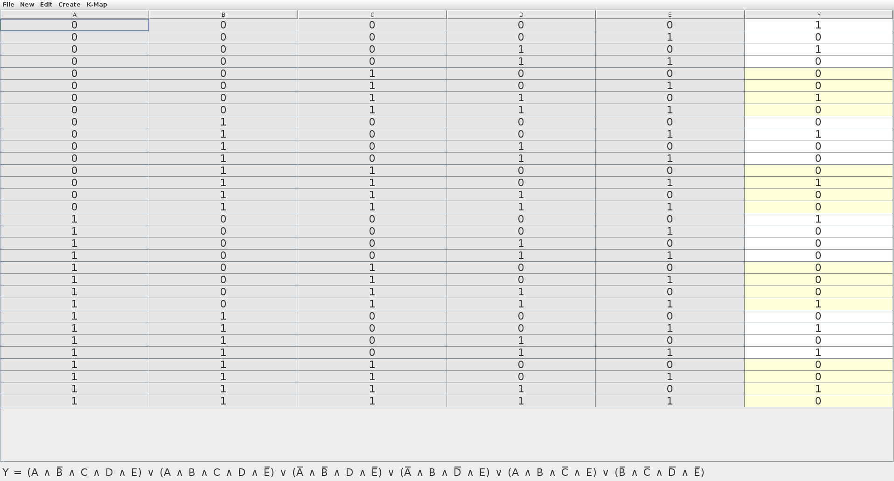

# Homework 9 (MSI)

## Design a logical circuit for the equationbelow, using `8:1 MUX`.

$$Y = \bar{A}\bar{B}\bar{C}\bar{D}\bar{E} + \bar{A}\bar{B}\bar{C}D\bar{E} + \bar{A}B\bar{C}\bar{D}E + \bar{A}\bar{B}CD\bar{E} + A\bar{B}\bar{C}\bar{D}\bar{E} + A\bar{B}CDE + \bar{A}BC\bar{D}E + AB\bar{C}E + ABCD$$

## Solution

Plot $Y$ into the `VEM` table:

| $A \backslash BC$ | $00$ | $01$ | $11$ | $10$ |
| :-----------: | :-: | :-: | :-: | :-: |
| $0$ | $\bar{D}\bar{E} + D\bar{E} \\ = \bar{E}$ | $D\bar{E}$ | $\bar{D}E$ | $\bar{D}E$ |
| $1$ | $\bar{D}\bar{E}$ | $DE$ | $D$ | $E$ |

## Check Answer

From:

$$Y = \bar{A}\bar{B}\bar{C}\bar{D}\bar{E} + \bar{A}\bar{B}\bar{C}D\bar{E} + \bar{A}\bar{B}CD\bar{E} + A\bar{B}\bar{C}\bar{D}\bar{E} + A\bar{B}CDE + \bar{A}BC\bar{D} + AB\bar{C}E + ABCD$$

We can plot into truth table as follow:

| Decimal | $A$ | $B$ | $C$ | $D$ | $E$ | $Y$ | Determinant $(D,E) \rightarrow Y$ |
| :-----: | :-: | :-: | -: | :-: | :-: | :-: | :--------------------------------: |
|  0  | 0 | 0 | 0 | 0 | 0 | 0 | $\bar{E}$ |
|  1  | 0 | 0 | 0 | 0 | 1 | 1 | $\bar{E}$ |
|  2  | 0 | 0 | 0 | 1 | 0 | 0 | $\bar{E}$ |
|  3  | 0 | 0 | 0 | 1 | 1 | 1 | $\bar{E}$ |
|  4  | 0 | 0 | 1 | 0 | 0 | 0 | $D\bar{E}$ |
|  5  | 0 | 0 | 1 | 0 | 1 | 0 | $D\bar{E}$ |
|  6  | 0 | 0 | 1 | 1 | 0 | 1 | $D\bar{E}$ |
|  7  | 0 | 0 | 1 | 1 | 1 | 0 | $D\bar{E}$ |
|  8  | 0 | 1 | 0 | 0 | 0 | 0 | $\bar{D}E$ |
|  9  | 0 | 1 | 0 | 0 | 1 | 1 | $\bar{D}E$ |
| 10  | 0 | 1 | 0 | 1 | 0 | 0 | $\bar{D}E$ |
| 11  | 0 | 1 | 0 | 1 | 1 | 0 | $\bar{D}E$ |
| 12  | 0 | 1 | 1 | 0 | 0 | 0 | $\bar{D}E$ |
| 13  | 0 | 1 | 1 | 0 | 1 | 1 | $\bar{D}E$ |
| 14  | 0 | 1 | 1 | 1 | 0 | 0 | $\bar{D}E$ |
| 15  | 0 | 1 | 1 | 1 | 1 | 0 | $\bar{D}E$ |
| 16  | 1 | 0 | 0 | 0 | 0 | 1 | $\bar{D}\bar{E}$ |
| 17  | 1 | 0 | 0 | 0 | 1 | 0 | $\bar{D}\bar{E}$ |
| 18  | 1 | 0 | 0 | 1 | 0 | 0 | $\bar{D}\bar{E}$ |
| 19  | 1 | 0 | 0 | 1 | 1 | 0 | $\bar{D}\bar{E}$ |
| 20  | 1 | 0 | 1 | 0 | 0 | 0 | $DE$ |
| 21  | 1 | 0 | 1 | 0 | 1 | 0 | $DE$ |
| 22  | 1 | 0 | 1 | 1 | 0 | 0 | $DE$ |
| 23  | 1 | 0 | 1 | 1 | 1 | 1 | $DE$ |
| 24  | 1 | 1 | 0 | 0 | 0 | 0 | $E$ |
| 25  | 1 | 1 | 0 | 0 | 1 | 1 | $E$ |
| 26  | 1 | 1 | 0 | 1 | 0 | 0 | $E$ |
| 27  | 1 | 1 | 0 | 1 | 1 | 1 | $E$ |
| 28  | 1 | 1 | 1 | 0 | 0 | 0 | $D$ |
| 29  | 1 | 1 | 1 | 0 | 1 | 0 | $D$ |
| 30  | 1 | 1 | 1 | 1 | 0 | 1 | $D$ |
| 31  | 1 | 1 | 1 | 1 | 1 | 0 | $D$ |
