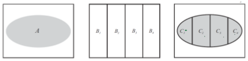
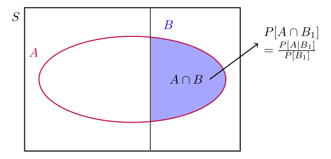

# Lecture 2: Probability Fundamental II

## Probability Axioms

### Basic Probability Formula

$P[E_{A}] = \frac{n[E_{A}]}{n[S_{A}]}$  

where

- $E_{A}$ is Event A.
- $n[E_{A}]$ is the number of outcomes of Event A.
- $n[S_{A}]$ is all number of outcomes of Event A (Sample space of A).

### Relative Frequency

#### Relative Frequency Definition

In theory, where experiment is repeated $n$ times  

$$P[A] = \lim\limits_{n\to\infty}\frac{n[A]}{n}$$

1. $0 < \frac{P[A_{i}]}{n} \le 1$ where $\frac{P[A_{i}]}{n} = 0$ if
$A$ occurs in none of the $n$ repeated trials **and**
$\frac{P[A_{i}]}{n} = 0$ where $A$ occurs in all of the $n$ repeated
trials.
2. If $A$ and $B$ **are mutually exclusive events**, then
$$n[A \cup B] = n[A] + n[B]$$
$$\therefore \frac{n[A \cup B]}{n} = \frac{n[A]}{n} + \frac{n[B]}{n}$$
where
- $\frac{n[A]}{n}$ is the relative frequency of event $A$
- $\frac{n[A]}{n}$ is the relative frequency of event $B$

Practically, $n$ is normally no where near $\infty$  

$$ \therefore P[A] = \sum_{i = 1}^{n} \frac{P[A_{i}]}{n}$$

> [!NOTE]
> $n[S_{A}] = n$  

### Axioms of Probability

1. $P[A] \ge 0; \forall A$ where $A$ is an event
2. $P[A] = 1$ where S is any Sample Space
3. $$P[\bigcup_{i = 1}^{n} A_{i}] = \sum_{i = 1}^{n} P[A_{i}]; \forall A_{n} \text{ and } A_{i} \cup A_{j} = \phi \text{ where }i \ne j; n, i, j \in \mathbb{N}$$

### Theorems of Probability

1.3 For mutually exclusive events, $A_{1}$ and $A_{2}$,
$$P[A_{1} \cup A_{2}] = P[A_{1}] + P[A_{2}]$$

1.4
$$P[A] = \sum_{i = 1}^{n} P[A_{i}]; \forall A_{n} \text{ and } A_{i} \cup A_{j} = \phi \text{ where }i \ne j; n, i, j \in \mathbb{N}$$

1.5 Because the events in sample space are all mutually exclusive events.$\therefore B = \{ s_{1}, s_{2}, s_{3}, ..., s_{m} \}$
$$P[B] = \sum_{i = 1}^{m} P[\{ s_{i} \}]$$

1.6 If the experiment with $S = \{ s_{1}, s_{2}, s_{3}, ..., s_{n} \}$
in which each outcomes $s_{i}$ is equally likely
$$\therefore P[s_{i}] = \frac{1}{n}; 1 \le i \le n$$

> [!NOTE]
> From Theorem 1.6, we can also conclude that  
> $$P[S] = \sum_{i = 1}^{n} P[s_{i}] = np$$
> where $p = P[s_{i}]; 1 \le i \le n$  
> Because $P[S] = 1$  

1.7 We can define more definitions
- $P[\phi] = 0$
- $P[A^{c}] = 1 - P[A]$ (Compliment)
- $$P[A \cup B] = P[A] + P[B] - P[A \cap B]$$
($A$ and $B$ do not need to be mutually exclusive.)
- If $A \subset B$, then $P[A] \le P[B]

1.8 $\forall A$ where $A = {B_{1}, B_{2}, B_{3}, ..., B_{m}}; m \in \mathbb{N}$
where $A$ and $B$ are different events
$$P[A] = \sum_{i = 1}^{m} P[A \cap B]$$

> [!NOTE]
> The proof come from Theorem 1.2 and Theorem 1.4 combined all together.

Recall from Theorem 1.2,  

    

$A_{i} = A \cap B_{i}= C_{i}$ where $i \in \mathbb{N}$ and $i \le n$

$$\therefore A = C$$
$$\therefore A = (\bigcup_{i = 1}^{n}) C_{i} \text{ where }n \in \mathbb{N}$$
$$ P[A] = P[(\bigcup_{i = 1}^{n}) C_{i}] \text{ where }n \in \mathbb{N}$$
$$ P[A] = \sum_{i = 1}^{n} P[C_{i}] \text{ where }n \in \mathbb{N}$$
$$ P[A] = \sum_{i = 1}^{n} P[A \cap B_{i}] \text{ where }n \in \mathbb{N}$$

## Conditional Probability

### Definition of Conditional Probability

#### Notation of Conditional Probability

$$P[A \mid B]$$

means "ther probability of $A$ given $B$"

#### Conditional Probability Formula

$$P[A \mid B] = \frac{P[AB]}{P[B]}$$

where $P[AB]$ is the same as $P[A \cap B]$

    

### Axioms of Probability from Conditional Probability

1. $P[A \mid B] \ge 0$
2. $P[B \mid B] = 0$
3. If  
$$A = \bigcup_{i = 1}^{n} \text{ where } n \in \mathbb{N}$$

where $\forall A$ are mutually exclusive, then  

$$P[A \mid B] = \sum_{i = 1}^{n} P[A_{i} \mid B] \text{ where } n \in \mathbb{N}$$

---
Author:[Pottarr](https://github.com/Pottarr)
