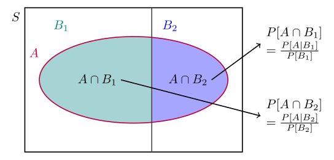

# Lecture 3: Law of Total Probability and Bayes' Theorem

## Theorem of Probability from Condtional Probability (Law of Total Probability)

10. Law of Total Probability

    

---
Author:[Pottarr](https://github.com/Pottarr)
