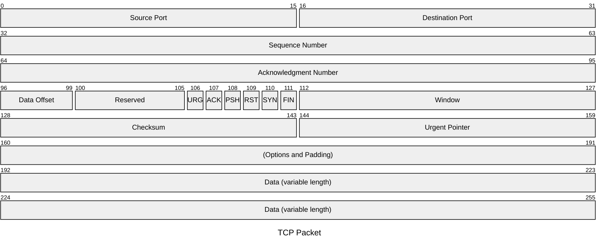

# Lecture 4

## Data Link Layer

### Services Provided to the Network Layer

> [!NOTE]  
> In these lectures, we use the virtual data path (Layer talk to Layer).

### Framing

#### Framing (1) (Obsolete)

- Collection Size

#### Framing (Collector Stuffing) (Obsolete)



#### Framing (Bit Stuffing) (Current Method)

- Save the space

**Example**:  

```
1. 0110 1111 1111 1111 1111 0010
2. 0110 1111 1011 1110 1111 1010 010
              ^      ^       ^
              |      |       |
              |-Stuffed Bits-|     (In this case, we stuff every 5 1s.)
3. 0110 1111 1111 1111 1111 0010
```

1. (a) The original data
2. The data as they appear on the line
3. The data after they are stored in receiver's memory after destuffing

### Error Control

#### Error-Correcting

- Collect the error and ask the sender to resend
- Not much in this course

#### Error-Detecting

- Dump everything away and ask the sender to resend

##### Error Detection Function

##### Parity Bit Memory

- Putting an extra bit into the collector
```
0011 1100 0
          ^
Parity Bit if Even

1011 1100 1
          ^
Parity Bit if Odd
```

#### CRC Error Control

- Modulo 2 Arithmetic
    - Binary Addition with no Carry by XOR

T = (k + n) Bit frame to be transmitted, with n < k
K = k Bit message, the first k bits of T
F = n Bit FCS, the last n bits in T
P = Pattern of n + 1 bits; this is the predetermined divisor (AKA Error
Function Generator).

> [!NOTE]  
> FCS (Frame Check Sequence)

Therefore:
- T = Whole transmission
- M = Message (First portion of T)
- F = FCS (Second portion of T)
- P = The divider

We would like T/P to have no remainder. thus;

$$T = 2^{n} M + F$$

How to get F

$$\frac{2^{n} M}{P} =  Q + \frac{R}{P}$$

- R: Remainder
- Q: Quotient

$$\therefore T = 2^{M} + R$$

**Error Proving**:

$$\frac{T}{P} = \frac{2^{n} M + R}{P}$$
$$\frac{T}{P} = Q + \frac{R}{P} + \frac{R}{P} = Q$$

$\therefore$ if no error, $Q\ \%\ 2 = 0$

Exercise:

- P = 1100 1
- M = 1100 0011 1110
- F = ?

**Solution**:

### Flow Control

#### Stop and Wait

### Fragmentation

#### Stop and Wait Link Utilization

- $t_{0}$: First Bit Out
- $t_{0} + 1$: Last Bit Out
- $t_{0} + \alpha$: First Bit Arrive
- $t_{0} + \alpha + 1$: Last Bit Arrive
- $t_{0} + 2 \alpha + 1$: ACK Signal Receive

#### Sliding Window Protocols

- A One-Bit Sliding Window Protocol
- A Protocol Using Go Back N
    - Resend from the Nth index where error is found till the end of
    the message
    - Need more memory
    - Need to wait for Nth error signal
- A Protocol Using Selective Repeat

##### Sliding Window Protocol
