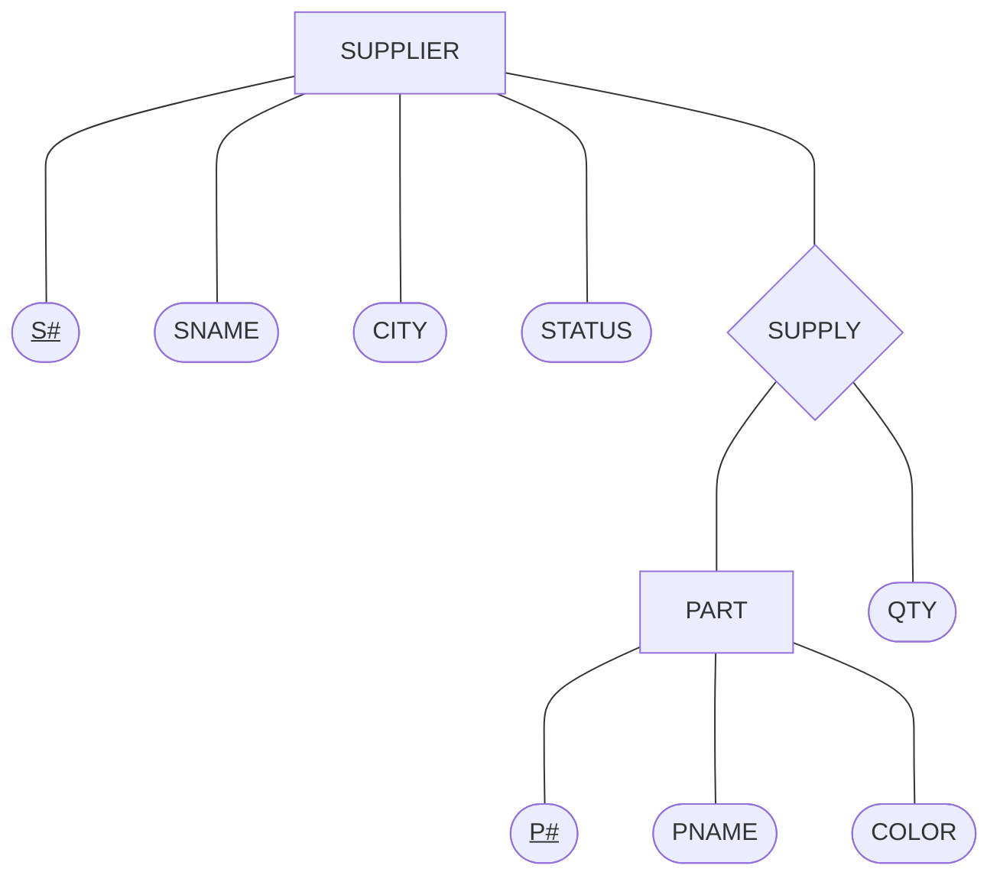
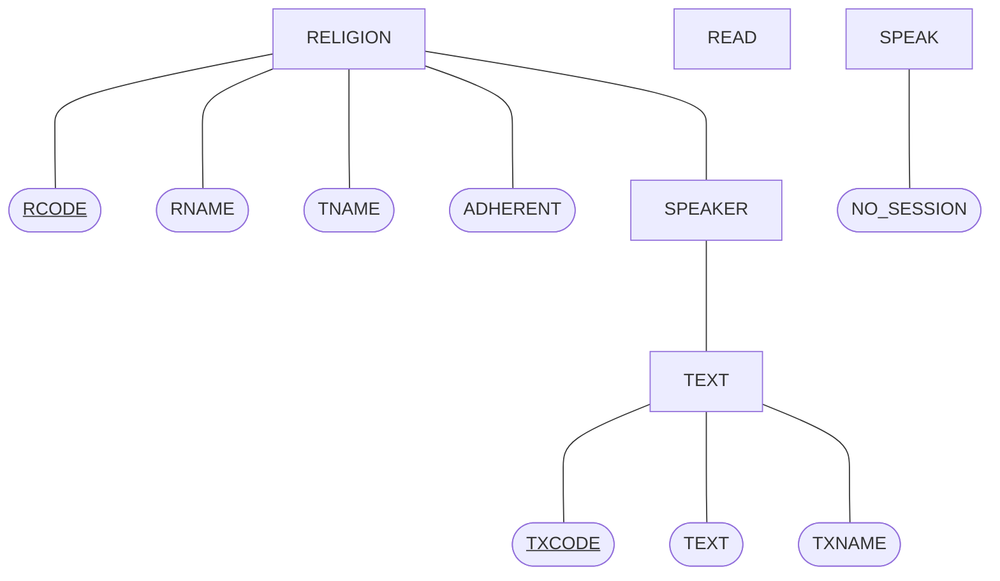
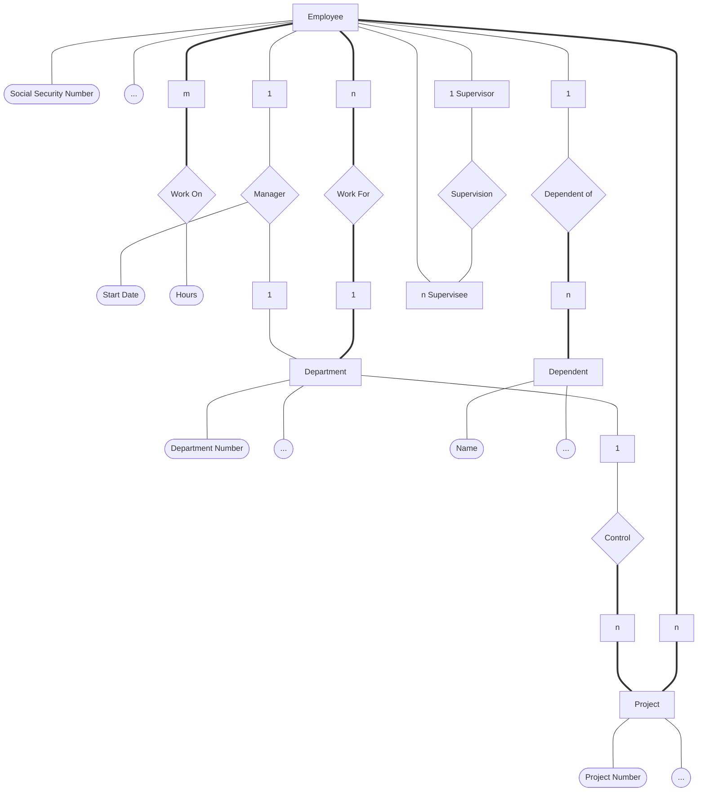
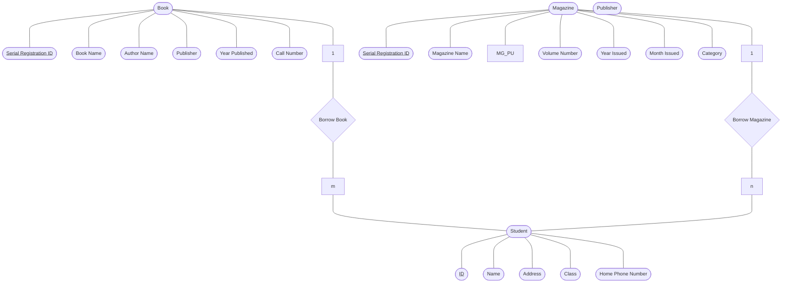

# Lecture 10

## Mapping ERD to Relational Table

> [!IMPORTANT]  
> The mapping are not going to guarantee to map to 3NF since they still
> are no FD. (See in Appendix EX1)

See mostly in Appendix

## Key Takeaway
- After mapping from ERD, the tables are not guarantee to be 3NF.

## Final Leak
- None today...

## Appendix

### Case Study (Religion Talk)

### EX1.0: Supply

`SUPPLIER` Table:

- `CITY` $\rightarrow$ `STATUS`

| S# (PK) | SNAME | CITY | STATUS |
| :-----: | :---: | :--: | :----: |

`PART` Table:

| P# (PK) | PNAME | COLOR |
| :-----: | :---: | :---: |

`SUPPLY` Table:

| S# (PK) | P# (PK) | QTY |
| :-----: | :-----: | :-: |

### EX1.1

| S# (PK) | SNAME | CITY | STATUS | P# (PK) | PNAME | COLOR | QTY |
| :-----: | :---: | :--: | :----: | :-----: | :---: | :---: | :-: |

> [!IMPORTANT]  
> From EX1.1, from here if the ERD has `1 - 1` relationship types. We
> cannot map it into a big table.

> [!NOTE]  
> We can map `1 - 1` relationship into 2 ways. (See in EX1.2)

### EX1.2.1

`SUPPLIER` Table:

| S# (PK) | SNAME | CITY | STATUS |
| :-----: | :---: | :--: | :----: |

`PART` Table:

| P# (PK) | PNAME | COLOR |
| :-----: | :---: | :---: |

`SUPPLY` Table:

| S# (PK) | P# (PK) | QTY |
| :-----: | :-----: | :-: |

### EX1.2.2.1

In this case, we extend the `SUPPLIER` Table.
This is useful when the query are mainly ask for supplier details, else
we need to join table.

`SUPPLIER` Table:

| S# (PK) | SNAME | CITY | STATUS | P# (FK) | QTY |
| :-----: | :---: | :--: | :----: | :-----: | :-: |

`PART` Table:

| P# (PK) | PNAME | COLOR |
| :-----: | :---: | :---: |

### EX1.2.2.2

In this case, we extend the `PART` Table.
This is useful when the query are mainly ask for part details, else we
need to join table.

`PART` Table:

| P# (PK) | PNAME | COLOR | S# (FK) | QTY |
| :-----: | :---: | :---: | :-----: | :-: |

`SUPPLIER` Table:

| S# (PK) | SNAME | CITY | STATUS |
| :-----: | :---: | :--: | :----: |

### EX1.3

When the relationship types is `1 - Many`, the only correct way is

`PART` Table:

| P# (PK) | PNAME | COLOR | S# (FK) | QTY |
| :-----: | :---: | :---: | :-----: | :-: |

`SUPPLIER` Table:

| S# (PK) | SNAME | CITY | STATUS |
| :-----: | :---: | :--: | :----: |

If we use this (which is wrong)

`SUPPLIER` Table:

| S# (PK) | SNAME | CITY | STATUS | P# (FK) | QTY |
| :-----: | :---: | :--: | :----: | :-----: | :-: |

`PART` Table:

| P# (PK) | PNAME | COLOR |
| :-----: | :---: | :---: |

It will have the array of `(P#, QTY)` which violate the rule of
Relational DB.

### EX1.4

When the relationship types is `Many - Many`, the only correct way is

In this case, we must use the 3rd table.

`SUPPLIER` Table:

| S# (PK) | SNAME | CITY | STATUS |
| :-----: | :---: | :--: | :----: |

`PART` Table:

| P# (PK) | PNAME | COLOR |
| :-----: | :---: | :---: |

`SUPPLY` Table:

| S# (PK) | P# (PK) | QTY |
| :-----: | :-----: | :-: |

> ![IMPORTANT]  
> BUT we cannot conclude that it is in 3NF, since we have not known about
> `CITY` $\rightarrow$ `STATUS` FD.

### EX2: Case Study (Religion Talk) (Cont.)

`RELIGION` Table:

| RCODE (PK) | RNAME | TNAME | ADHERENT |
| :--------: | :---: | :---: | :------: |

`TEXT` Table:

| TXCODE (PK) | TEXT | TXNAME | RCODE (FK) |
| :---------: | :--: | :----: | :--------: |

`SPEAKER` Table:

| SNAME (PK) |
| :--------: |

`READ` Table:

| SNAME (PK, FK) | TXCODE (PK, FK) |
| :------------: | :-------------: |

`SPEAK` Table:

| SNAME (PK, FK) | RCODE (PK, FK) | NO_SESSION |
| :------------: | :------------: | :--------: |

> [!NOTE]  
> `RELIGION`, `TEXT` and `SPEAKER` Tables represent entity schema where
> relations there represent entity instances.  
> `READ` and `SPEAK` Tables represent relationship types where
> relations there represent relationship instances.

> [!TIP]  
> Sometimes, entity table can be called `Master Table`.
> Also, relationship table can be called `Transaction Table` too.

> [!NOTE]  
> `SPEAKER` Table is a table with unary relation.

Now, we shall normalize it to 5NF. (We added Alternate Key to let you
know more.)

`RELIGION` Table:

| RCODE (PK) | RNAME (AK) | TNAME (AK) | ADHERENT |
| :--------: | :--------: | :--------: | :------: |

`TEXT` Table:

| TXCODE (PK) | TEXT (AK) | TXNAME | RCODE (FK) |
| :---------: | :-------: | :----: | :--------: |

`SPEAKER` Table:

| SNAME (PK) |
| :--------: |

`READ` Table:

| SNAME (PK, FK) | TXCODE (PK, FK) |
| :------------: | :-------------: |

`SPEAK` Table:

| SNAME (PK, FK) | RCODE (PK, FK) | NO_SESSION |
| :------------: | :------------: | :--------: |

Yes, the same set of tables...  
$\therefore$ it is already in 5NF.

### EX3: Employees and Departments

### EX4: Case Study (Library)

Given Properties:
- Book
    - Book Name
    - Author Name
    - Publisher
    - Year Published
    - Call Number
    - Serial Registration Number
- Magazine
    - Magazine Name
    - Magazine Publisher
    - Magazine Volume Number
    - Month Issued
    - Year Issued
    - Category
    - Serial Registration Number
- Student
    - ID
    - Name
    - Address
    - Class
    - Home Phone Number

We can draw as ERD as follow:

We can separate into tables as follow:

`BOOK` Table:

| BSID (PK) | BNAME | ANAME | PUBLISHER | PUBL_YEAR | CALL_NO |
| :-------: | :---: | :---: | :-------: | :-------: | :-----: |

`MAGAZINE` Table:

| MSID (PK) | MNAME | PUBLISHER | VOL_NO | PUBL_YEAR | PUBL_MONTH | CATEGORY |
| :-------: | :---: | :-------: | :----: | :-------: | :--------: | :------: |

`STUDENT` Table:

| ID (PK) | SNAME | ADDRESS | CLASS | PHONE |
| :-----: | :---: | :-----: | :---: | :---: |

`BK_BORROW` Table:

| ID (PK, FK) | BSID (PK, FK) |
| :---------: | :-----------: |

`MG_BORROW` Table:

| ID (PK, FK) | MSID (PK, FK) |
| :---------: | :-----------: |
