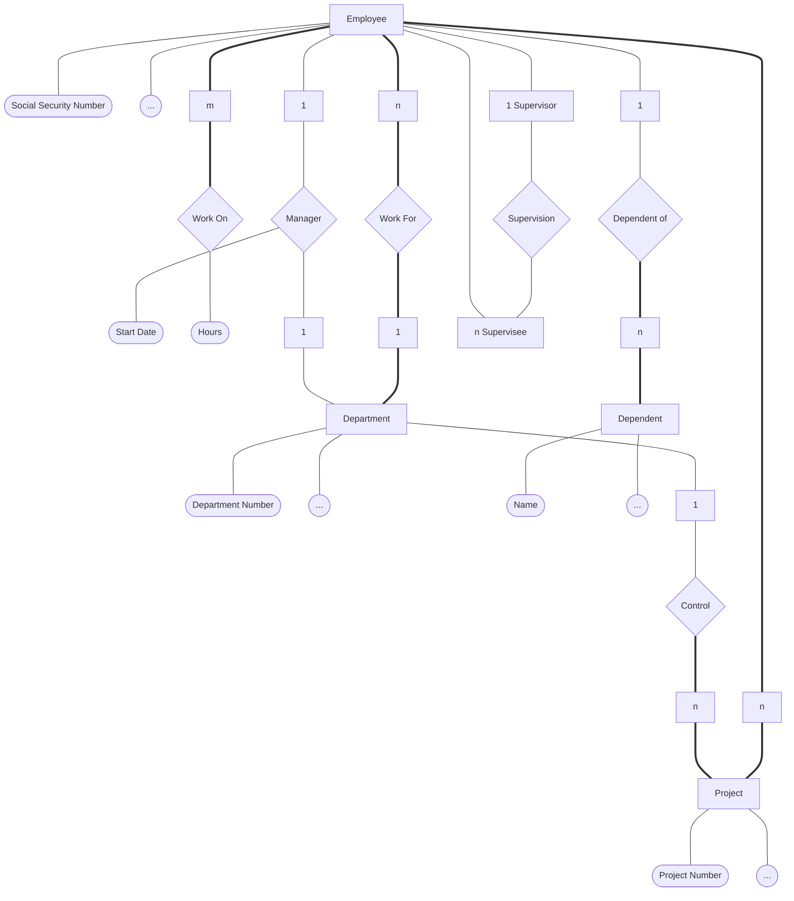
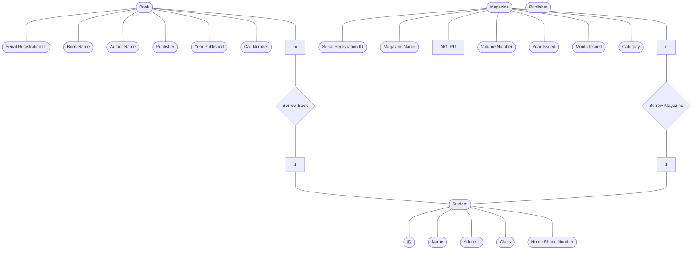

# Lecture 11

## From previous lecture

We have done some work on `EX1.0`, now we do `EX1.1`

## Identifier Problem

- How to fix:
    - Find alternative identifiers
    - Use a surrogate key (system-generated, or application-generated
    identifiers)
    - Denormalization (to avoid the join BUT will face `INSERT` and
    `DELETE` problems)

## SQL

### SQL Modes of Operation

- Interactive Mode
    - User keys query into UI and send to DBMS and DBMS sends back to
    the UI.
- Embedded Mode
    - The program sends query to the DBMS and DBMS sends back to the
    program.

## Key Takeaway
- Definition misinterpretation:
    - In `EX0` do not call `DEPARTMENT` and `EMPLOYEE` entities, they
    are entity types
    - In `EX0` do not call `WORK_FOR` relation or relationship, it is
    relation type
    - Correct Definition in `EX0`: Entity type `EMPLOYEE` has Many to 1
    relationship type of `WORK_FOR` with entity type `DEPARTMENT`.
- In `EX2`, `SUPPLIER` entities instances are the actual suppliers
themselves BUT the `PART` entity instances are not the actual parts.
- In `EX3`, `CAR` entities instances can be interpreted into many ways:
    - Actual car itself individually
    - Car model
    - Solution: Make 2 entity types, `CAR` and `CAR_MODEL` where many
    `CAR` entity instances can be in 1 `CAR_MODEL` entity instance by
    using `HAS` relationship instances as `CAR` `HAS` `CAR_MODEL` by
    Many to 1.

## Final Leak
- None today...

## Appendix

### EX0



### EX1.0


`BOOK` Table:

| BSID (PK) | BNAME | ANAME | PUBLISHER | PUBL_YEAR | CALL_NO |
| :-------: | :---: | :---: | :-------: | :-------: | :-----: |

`MAGAZINE` Table:

| MSID (PK) | MNAME | PUBLISHER | VOL_NO | PUBL_YEAR | PUBL_MONTH | CATEGORY |
| :-------: | :---: | :-------: | :----: | :-------: | :--------: | :------: |

`STUDENT` Table:

| ID (PK) | SNAME | ADDRESS | CLASS | PHONE |
| :-----: | :---: | :-----: | :---: | :---: |

`BK_BORROW` Table:

| ID (PK, FK) | BSID (PK, FK) |
| :---------: | :-----------: |

`MG_BORROW` Table:

| ID (PK, FK) | MSID (PK, FK) |
| :---------: | :-----------: |

### EX1.1



> [!NOTE]  
> Don't forget to add `TEACHER` on the mermaid on the top diagram

`BOOK` Table:

Determinant:
- `CALL_NO` $\rightarrow$ `BNAME`
- `CALL_NO` $\rightarrow$ `PUBLISHER`
- `CALL_NO` $\rightarrow$ `A1`
- `CALL_NO` $\rightarrow$ `A2`
- `CALL_NO` $\rightarrow$ `A3`

| BSID (PK) | BNAME | A1 | A2 | A3 |PUBLISHER | PUBL_YEAR | CALL_NO | ID (FK) | BORROW_DATE |
| :-------: | :---: | :-: | :-: | :-: | :---: | :-------: | :-----: | :-----: | :---------: |

`MAGAZINE` Table:

Determinant:
- `MNAME` $\rightarrow$ `PUBLISHER`
- `MNAME` $\rightarrow$ `CATEGORY`

| MSID (PK) | MNAME | PUBLISHER | VOL_NO | PUBL_YEAR | PUBL_MONTH | CATEGORY | ID (FK) | BORROW_DATE |
| :-------: | :---: | :-------: | :----: | :-------: | :--------: | :------: | :-----: | :---------: |

`STUDENT` Table:

| ID (PK) | SNAME | ADDRESS | PHONE | CLASS | TEACHER |
| :-----: | :---: | :-----: | :---: | :---: | :-----: |

We can normalize them to 5NF:

`TITLE_BOOK` Table:

- Added `ISBN` to be PK

| ISBN (PK) | CALL_NO | BNAME | PUBLISHER | A1 | A2 | A3 |
| :-------: | :-----: | :---: | :----: | :-: | :-: | :-: |

`BOOK` Table:

| BSID (PK) | CALL_NO (FK) | ID | BORROW_DATE |
| :-------: | :----------: | :-: | :--------: |

`TITLE_MAGAZINE` Table:

- Added `M#` to be PK

| M# (PK) | MNAME | PUBLISHER | CATEGORY |
| :-----: | :---: | :-------: | :------: |

`MAGAZINE` Table:

| MSID (PK) | MNAME (FK) | VOL_NO | PUBL_MONTH | PUBL_YEAR |
| :-------: | :--------: | :----: | :--------: | :-------: |

`STUDENT` Table:

| ID (PK) | SNAME | ADDRESS | PHONE | CLASS |
| :-----: | :---: | :-----: | :---: | :---: |

`CLASS` Table:

| CLASS (PK) | TEACHER |
| :--------: | :-----: |

### EX2

### EX3

`CAR` Table:

| CREG# (PK) | ... | CM# (FK) |
| :--------: | :-| :------: |

`CAR_MODEL` Table:

| CM# (PK) | ... |
| :------: | :-: |

### EX4 (library on Steroid)

```mermaid
flowchart TD
```

`TITLE_BOOK` Table:
`BOOK` Table:
`TITLE_MAGAZINE` Table:
`MAGAZINE` Table:
`STUDENT` Table:

### EX5 (Book Borrowing on Steroid)

```mermaid
flowchart TD
```

One student may have many books borrwed but each book may only belongs
one student at the same time.

We need an identifier to identify each relationship instance.
$\therefore$ we need to change `BK_BORROW` from relationship type to
be an entity type which we call it an `Associate Entity Type`
(Entity Type which was once a Relationship Type).

### EX6 (Sport Equipment Set Borrow)

`STUDENT` Table:

| ID (PK) | ... |
| :-----: | :-: |

`ITEM` Table:

| I# (PK) | ... |
| :-----: | :-: |

`ITEM_BORROW` Table:

| IB# (PK) | ... | ID (FK) |
| :------: | :-: | :-----: |

`HAS` Table:

| IB# (PK) | I# |
| :-----: | :-: |
