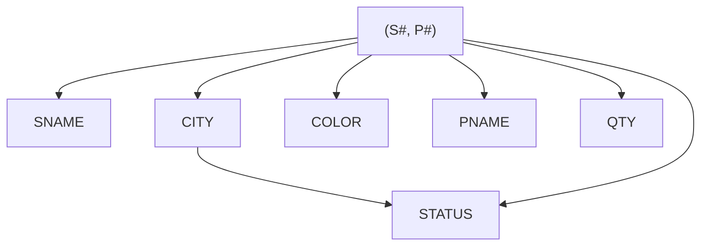
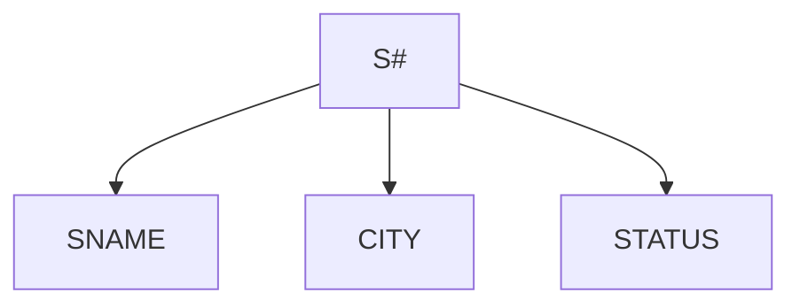
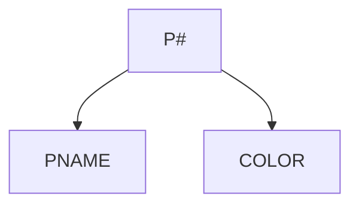
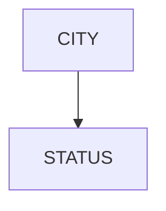
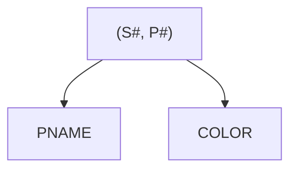

# Lecture 6

## From previous lecture

From these tables:

Table `S`:

| S# | SNAME | STATUS | CITY |
| :-: | :--: | :----: | :--: |
| S1 | Smith | 20 | London |
| S2 | Jones | 10 | Paris |

Table `P`:

| S# | PNAME | COLOR | WEIGHT | CITY |
| :-: | :--: | :----: | :----: | :--: |
| P1 | Nut | Red | 12 | London |
| P2 | Bolt | Green | 17 | Paris |
| P3 | Screw | Blue | 17 | Rome |

Table `SP`:

| S# | P# | QTY |
| :-: | :-: |:-: |
| S1 | P1 | 300 |
| S1 | P2 | 200 |
| S1 | P3 | 400 |
| S2 | P1 | 300 |

We learnt that:
- Why we use these 3 tables, not 1 big table?
    - Answer: To decrease insertion and deletion redundancies.
- Hardware might not a actual problem in some cases.
- 1NF
    - Every valid DB table
        - Need 4 properties:
            - 1 Attribute/ 1 Domain
            - Every Attribute must be atomic.
            - No 2 rows are the same.
            - Rows are unordered.

## Normalization

- Universe of relations 0NF (Normalized and Non-Normalized)
- 1NF relations (has all 4 basic properties)
- 2NF relations (has better `INSERT` and `DELETE`)
- 3NF relations (will be mentioned later)
- BCNF relations (will be mentioned later)
- 4NF relations (will be mentioned later)
- PJ/NF 5NF relations (no more redundancy)

### 1st Normal Form

Properties:
- Need 4 properties:
    - 1 Attribute/ 1 Domain
    - **`Every Attribute must be atomic.`**
    - No 2 rows are the same.
    - Rows are unordered.

### 2nd Normal Form (2NF)

Properties:
- Included in 1NF
- Every Non-Key Element must be `fully dependent` on the Primary
Key.

> [!NOTE]  
> Fully Dependent: Fully Functionally Dependent $\rightarrow$ Full `FD`  
> FD: An FD is a relationship between attributes in the form of function
> from `Many:1` or `1:1`  

Relation Variable `R`:
| $X$ | $Y$ |
| :-:| :-: |
| $x_{1}$ | $y_{1}$ |
| $x_{2}$ | $y_{2}$ |
| $x_{3}$ | $y_{3}$ |

We can see that:

$X \rightarrow Y$

or

$Y \text{ depends on } X$

$\therefore$ `FD` must be given.

What is `Full FD`?
- Answer: $Y$ must depends on $X$ as a whole, not the subset of $X$.
    - Example of Full FD: (S#, P#) $\rightarrow$ QTY
    - Example of Non-Full FD: (S#, STATUS) $\rightarrow$ CITY
        - Why?
            - Answer: Because `S#` alone determines `CITY` without
            `STATUS`.  
            $\therefore$ Since, `S#` $\subset$ `(S#, STATUS)` $\implies$
            `S#` $\subset$ $X$.

Table `MAIN` (Non-2NF):

| S# | SNAME | CITY | STATUS | P# | PNAME | COLOR | QTY |
| :-: | :--: | :--: | :----: | :-: | :--: | :---: | :-: |

Table `S`, `P`, `SP` (2NF):

Table `S`:

| S# | SNAME | CITY | STATUS |
| :-: | :--: | :--: | :----: |

Table `P`:

| P# | PNAME | COLOR |
| :-: | :--: | :---: |

Table `SP`:

| S# | P# | QTY |
| :-: | :-: | :-: |

In `SP`:
- `S#` is a Foreign Key associate to `S`.
- `P#` is a Foreign Key associate to `P`.
- `(S#, P#)` is a Primary Key.

BUT!!!
If `FD Misplacement`:

Case 1 (Remove the only row of that `CiTY`):

| S# | SNAME | CITY | STATUS |
| :-: | :--: | :--: | :----: |
| S1 | David | London | 100 |
| S1 | David | London | 200 |

We just added invalid `STATUS`.

Case 2 (Remove the only row of that `CITY`):

| S# | SNAME | CITY | STATUS |
| :-: | :--: | :--: | :----: |
| ~~S2~~ | ~~Peter~~ | ~~Paris~~ | ~~200~~ |

We just removed the only data about `Paris` that it has `STATUS` = 200.

We can see that 2NF does not consider FD between Non-Key, that we will
talk in 3NF.

#### FD Diagram

Table `MAIN`:

Table `S`:

Table `P`:

Table `C`:

Table `SP`:

> [!IMPORTANT]  
> In Normalization, a `Non-Key Attribute` is an attribute which is not
> part of a Candidate Key.

### 3rd Normal Form (3NF)

Properties:
- Included in 2NF
- No `FD`s between Non-Key Attributes

Table `S`, `P`, `SP` (Non-3NF):

Table `S`:

| S# | SNAME | CITY | STATUS |
| :-: | :--: | :--: | :----: |

Table `P`:

| P# | PNAME | COLOR |
| :-: | :--: | :---: |

Table `SP`:

| S# | P# | QTY |
| :-: | :-: | :-: |

Table `S`, `P`, `C`, `SP` (Non-3NF):

Table `S`:

| S# | SNAME | CITY |
| :-: | :--: | :--: |

Table `P`:

| P# | PNAME | COLOR |
| :-: | :--: | :---: |

Table `C`:

| CITY | STATUS |
| :--: | :----: |

Table `SP`:

| S# | P# | QTY |
| :-: | :-: | :-: |

Even though, 3NF was believed to cover all FD placement but Boyce got
the special cases that is a bug in 3NF  
$\therefore$ Boyce and Codd invented a new 3NF called Boyce-Codd
Normal Form to be talk in the next topic.

### Boyce-Codd Normal Form (BCNF)

Table `SSP`:

Suppose each `S#` has only 1 `SNAME`

| S# | SNAME | P# | QTY |
| :-: | :--: | :-: | :-: |

- Is this 2NF?
    - Answer: Yes
        - Reasons:
            - Non-Key: `QTY`
            - Candidate Keys: `(S#, P#)`, `(SNAME, P#)`
- Is this 3NF?
    - Answer: Will be discussed in the next lecture...

Properties:
- Has multiple Candidate Keys
- Those Candidate Key were composite.
- The Candidate Keys overlapped.

## Key Takeaway
- Non-Key Attribute
    - Outside of Normalization Context: A Non-Key Attribute is an
    attribute which is not a Candidate Key.
    - Inside of Normalization Context: A Non-Key Attribute is an
    attribute which is not part of a Candidate Key.
- An `FD` is an integrity constraint that must be preserved.
- `3NF` is not enough if beyond `FD` concepts.

## Midterm Leak
- Do 3NF of `Q1`
    - Answer: Cannot, 3NF is not enough.
        - Reasons:
            - We need to use concepts beyond `FD`.

Appendix:

Question: `Q1`

Table `RELIGION`:

| RELIGION_NAME | TEACHER | ADEERENT (MILLIONS) | TEXTS |
| :-----------: | :-----: | :-----------------: | :---: |
| Chistianity | Christ | 400 | Old Testament |
|     |    |   | New Testament |
| Budhism | Budha | 300 | Sutra |
| Muslim | Muhamad | 400 | Koran |
| Hinduism | Khrisna | 350 | Upanished |
|   |   |   | Pakavat kita |

Table `SPEAKER`:

| SPEAKER | TOPIC | NO. SESSIONS | TEXT_READ |
| :-----: | :---: | :----------: | :-------: |
| John | Christianity | 2 | Pakavat kita |
|   | Hinduism | 1 | Koran |
| Peter | Budhism | 2 | Old Testament |
|    |   |   | Koran |
| Chandra | Budhism | 3 | Old Testament |
|   | Chistianity | 1 | New Testament |
|    |   |   | Sutra |
